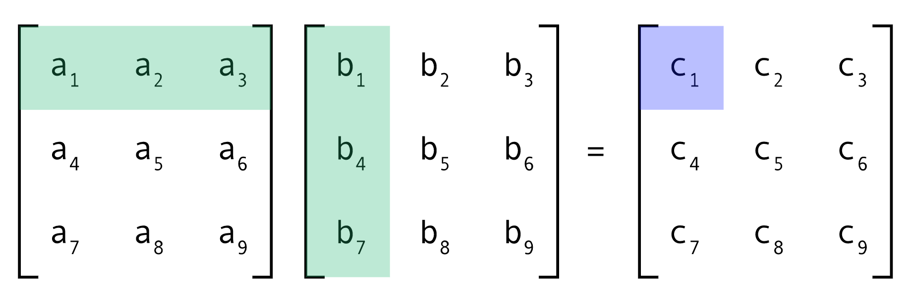

<br>

<p align="center">
<a href="https://github.com/3SUM"></a>
</p>

<br>

# matmul

Various matrix multiplcation methods implemented in C++.

If you have questions or concerns please feel free to contact me here or on **Discord @im.upset**.

## Build & Run

```
git clone https://github.com/3SUM/matmul.git
cd matmul/src
python3 matmul.py
make
./matmul
```

**Note** [matmul.py](src/matmul.py) is used to generate a data file to populate matrices accordingly for testing.

## License

&copy; [Luis Maya Aranda](https://github.com/3SUM). All rights reserved.

Licensed under the MIT License.
